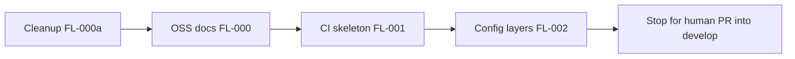

# Track A — Project setup, docs, and cleanup

## Defaults locked for this plan

- **License:** Apache-2.0 (fills `LICENSE`, `pom.xml`, README badge). Say if you prefer MIT/AGPL before implementation.
- **Branches:** Keep workflow as-is — `main` (releases) + `develop` (integration). Work stays on existing [`feature/FL-000-oss-bootstrap`](feature/FL-000-oss-bootstrap).
- **Scope:** Docs/OSS/CI/config + cleanup only. No new domain ledger model (that is FL-010). No `gh pr create`.

## Current state

- Already on `feature/FL-000-oss-bootstrap` (= `develop` = foundation commit `1dfc451`).
- `docs/PLAN_LEDGER_FINTECH.md` exists; root `PLAN_LEDGER_FINTECH.md` is a duplicate to remove.
- [`docs/adr/ADR-001-clean-architecture.md`](docs/adr/ADR-001-clean-architecture.md) is **deleted in the working tree** — restore and strengthen.
- Premature auth work is untracked and out of roadmap: `PasswordHasher`, `BCryptPasswordHasher`, `V2__create_users_table.sql`.
- Wrong-domain stubs: Flyway `users` tables (`V1`/`V2`), `domain/wallet/WalletCreatedEvent`.
- Spring Initializr noise: [`HELP.md`](HELP.md).
- Thin README; empty `pom.xml` name/description/license/scm; no `.github/workflows`.

## 1. Cleanup (first atomic commit)

**Delete**

| Path                                                                 | Why                                                       |
| -------------------------------------------------------------------- | --------------------------------------------------------- |
| [`HELP.md`](HELP.md)                                                 | Spring Initializr boilerplate                             |
| Root [`PLAN_LEDGER_FINTECH.md`](PLAN_LEDGER_FINTECH.md)              | Duplicate of `docs/PLAN_LEDGER_FINTECH.md`                |
| `application/auth/**` (`PasswordHasher`)                             | Premature; security is roadmap §19 #10                    |
| `infrastructure/security/BCryptPasswordHasher.java`                  | Same                                                      |
| `db/migration/V2__create_users_table.sql`                            | Premature users schema                                    |
| `domain/wallet/WalletCreatedEvent.java`                              | Not in plan (ledger uses `LedgerAccount`)                 |
| Thin audit stubs if they only scaffold empty types: `domain/audit/*` | Audit is §19 #9; empty stubs add noise before domain core |

**Replace Flyway `V1`**

- Rewrite [`V1__initial_schema.sql`](src/main/resources/db/migration/V1__initial_schema.sql) to a no-op marker migration (comment only: schema delivered in persistence phase FL-020). Do **not** keep a `users` table.

**Keep**

- Package skeleton + ArchUnit tests
- Shared: `Money`, `DomainException`, correlation filter
- `HealthController`, OpenAPI config, `application*.yml`, docker-compose, `.cursor/rules/`

**Git tree hygiene (local)**

- After FL-000 commits land: delete obsolete local branch `feature/architecture-foundation` (same tip as develop; redundant).
- Do **not** rewrite `main` history. Do **not** push unless you ask.
- Ensure `develop` remains the integration base; this feature branch stays based on `develop`.

## 2. FL-000 — OSS bootstrap (second commit)

Create:

| File                                                      | Purpose                                                                                                                                                                    |
| --------------------------------------------------------- | -------------------------------------------------------------------------------------------------------------------------------------------------------------------------- |
| `LICENSE`                                                 | Full Apache-2.0 text                                                                                                                                                       |
| [`README.md`](README.md)                                  | Powerful OSS README (plan §15): badges (CI/license/Java/Spring), why / non-assumptions, architecture link, quickstart, config summary, docs links, status/roadmap, license |
| `CONTRIBUTING.md`                                         | Branch model, phase gates, Conventional Commits, ArchUnit, how to run tests                                                                                                |
| `CODE_OF_CONDUCT.md`                                      | Contributor Covenant                                                                                                                                                       |
| `SECURITY.md`                                             | How to report vulnerabilities; no secrets in issues                                                                                                                        |
| `CHANGELOG.md`                                            | Keep a Changelog skeleton (`## [Unreleased]`)                                                                                                                              |
| `docs/adr/ADR-000-template.md`                            | ADR template                                                                                                                                                               |
| Restore + expand `docs/adr/ADR-001-clean-architecture.md` | Align with hexagonal layers in plan §2 + ArchUnit enforcement                                                                                                              |
| `docs/architecture.md`                                    | Short hexagonal overview + link to plan/ADRs                                                                                                                               |
| `docs/development.md`                                     | Ticket/branch map (FL-000…FL-170), mvn profiles, phase gate                                                                                                                |
| `.github/ISSUE_TEMPLATE/`                                 | bug + feature templates                                                                                                                                                    |
| `.github/PULL_REQUEST_TEMPLATE.md`                        | Checklist: tests, ArchUnit, docs/ADR if structural                                                                                                                         |

Update [`pom.xml`](pom.xml):

- `<name>FinLedger</name>`, description, URL `https://github.com/PaulUno777/finledger`
- Apache-2.0 `<licenses>`
- `<scm>` pointing at that GitHub repo
- Developer entry for PaulUno

Badge placeholders in README use `PaulUno777/finledger` (matches `origin`).

## 3. FL-001 — CI skeleton (third commit)

Add [`.github/workflows/ci.yml`](.github/workflows/ci.yml):

- Triggers: push/PR to `develop` (and PRs targeting `develop`)
- Job: JDK 21 + `./mvnw -B verify` (no `-DskipTests`)
- No Docker Hub publish yet (that is FL-140 / plan §19 #14)
- Stub [`release-docker.yml`](.github/workflows/release-docker.yml) only if it documents “disabled until FL-140” — prefer **omit** until Docker image exists, to avoid a red/no-op workflow. README notes “Docker release badges after FL-140”.

## 4. FL-002 — Config layers (fourth commit)

Align with plan §18.1:

- Document in `docs/configuration.md` and README §Configuration: image defaults → optional file mount → env vars → secrets via port later
- Update root config:
  - [`application.yaml`](src/main/resources/application.yaml): safe defaults; note `optional:file:./config/` / `/workspace/config/` pattern
  - [`application-test.yml`](src/main/resources/application-test.yml) / prod: keep lean; no hardcoded secrets
  - [`docker-compose.yml`](docker-compose.yml): add short comments or a compose `configs` note for mounting external config; keep Postgres/Redis as-is for local stack
- Do **not** invent a wizard or block boot on missing tenant

## 5. Verification before declaring Track A done

- `./mvnw -B test` (ArchUnit + smoke still green after deletions)
- Confirm no leftover `users` migration / auth classes
- Confirm single plan path: `docs/PLAN_LEDGER_FINTECH.md` only
- Commit with Conventional Commits (4 atomic commits as above)
- **Stop** for your PR into `develop` (human-owned). Do not start FL-010 until you confirm merge.

## Out of scope (explicit)

- Domain core (`LedgerAccount`, double-entry) — FL-010
- Real Dockerfile multi-arch publish — FL-140
- Pushing remotes / opening PRs unless you request
- Committing `.idea/` / `target/` (already gitignored)
